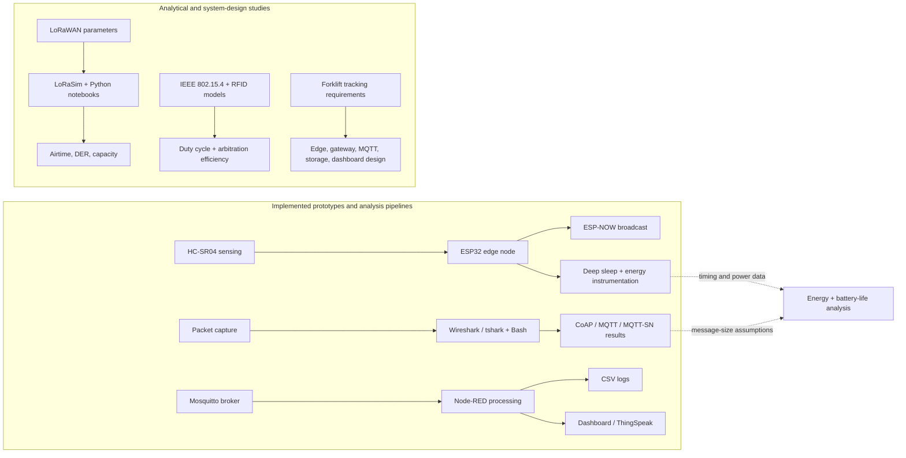
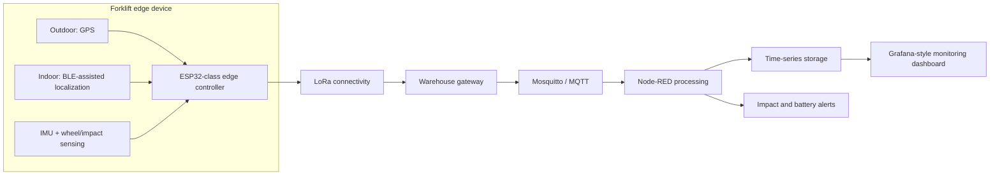
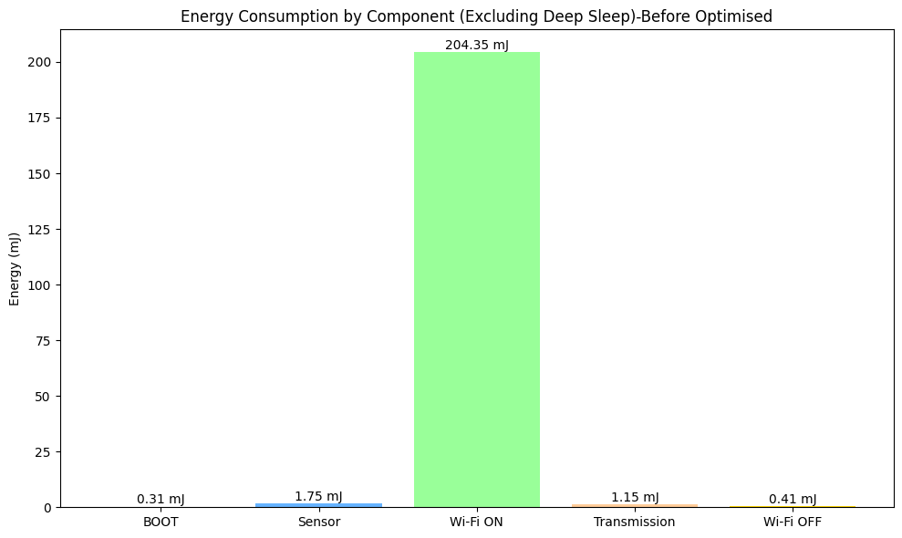
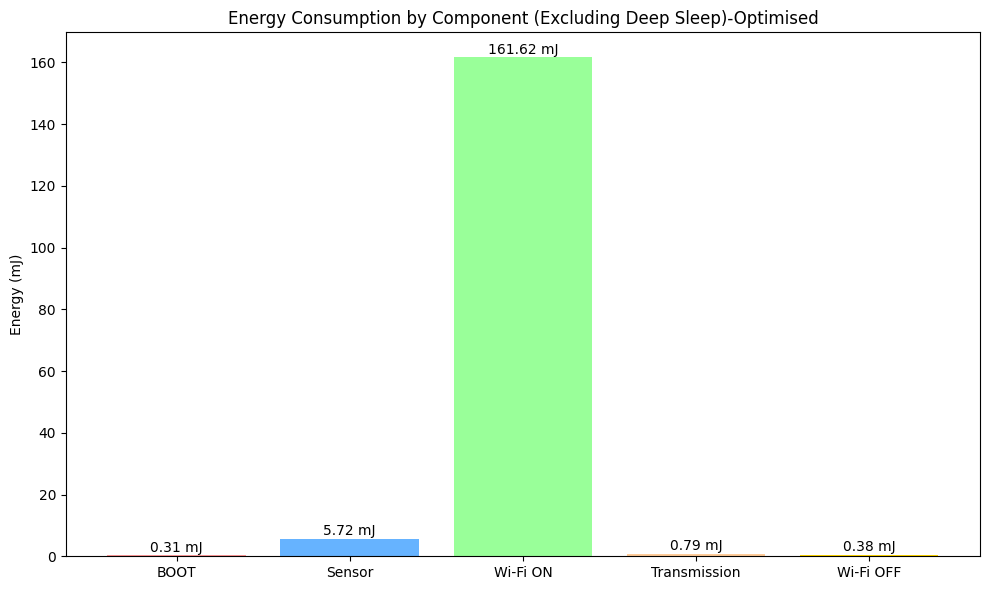
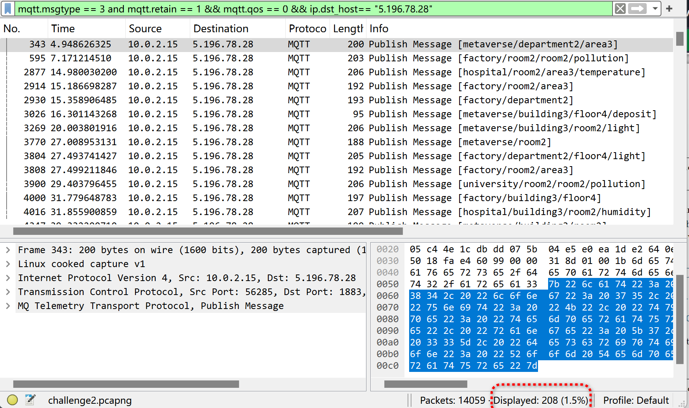
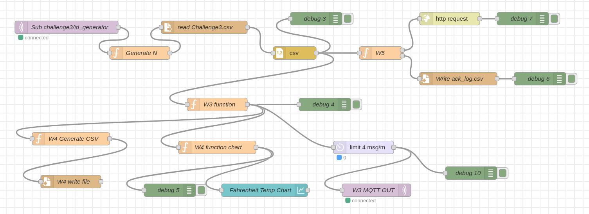
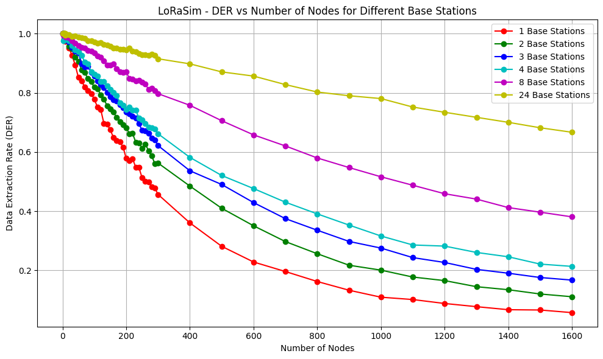
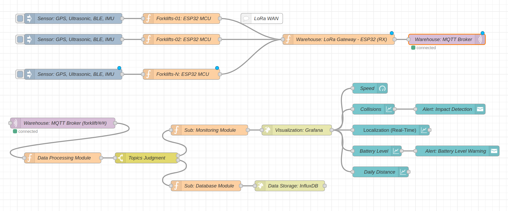

# Internet of Things Systems Engineering Portfolio

**Embedded sensing, low-power edge operation, IoT protocol analysis, message processing, wireless capacity evaluation, and connected-system design.**

This repository presents four complementary Internet of Things coursework projects completed at Politecnico di Milano. Together they demonstrate an engineering workflow that moves from an ESP32 sensor node and low-power firmware, through MQTT/CoAP packet analysis and Node-RED processing, to LoRaWAN capacity studies and an end-to-end Industrial IoT architecture.

The projects are independent prototypes and analytical studies—not a single production deployment. They are presented together to show breadth across the IoT stack and relevance to Industrial IoT, edge computing, low-power sensing, and connected monitoring systems.

[Explore the projects](#portfolio-projects) · [View the results](#selected-results) · [Browse the repository](#repository-structure) · [Reproduce the work](#how-to-explore-and-reproduce)

## Engineering Scope

| Area | Technologies used | Engineering role |
| --- | --- | --- |
| Embedded sensing and edge firmware | ESP32, HC-SR04, C/C++/Arduino, PlatformIO, Wokwi | Occupancy sensing, state classification, timing instrumentation, ESP-NOW transmission, Wi-Fi shutdown, and timer-based deep sleep |
| IoT connectivity and protocols | ESP-NOW, CoAP, MQTT, MQTT-SN, Mosquitto, LoRaWAN | Device-to-device communication, publish/subscribe messaging, constrained-protocol comparison, and long-range network analysis |
| Processing and integration | Node-RED, ThingSpeak, CSV logging | Message generation, filtering, rate limiting, acknowledgement logging, temperature extraction, HTTP export, and visualization |
| Network and data analysis | Wireshark, `tshark`, Bash, Python, Jupyter, LoRaSim | Repeatable packet filtering, protocol-energy modelling, reliability/capacity simulation, and result visualization |
| Wireless and system design | IEEE 802.15.4, RFID, Dynamic-Frame ALOHA, GPS/IMU, BLE | CFP sizing, duty-cycle analysis, RFID arbitration efficiency, and indoor/outdoor tracking architecture |

## Portfolio Architecture

The repository contains several implemented pipelines plus separate analytical and system-design studies. Solid arrows below represent implemented data paths; dotted arrows represent analysis performed on measurements, traces, or model outputs.



### Industrial IoT architecture study

The forklift study applies the same edge-to-application reasoning to a warehouse monitoring scenario. It is a system design, not a deployed production platform.



## Repository Structure

```text
IoT_2025_PoliMi/
├── challenge_1/
│   ├── submission/
│   │   ├── esp32IoT_Challenge01_CHEN_Hong/
│   │   │   ├── src/IoT_challenge_01_CHEN_Hong.ino
│   │   │   ├── platformio.ini
│   │   │   ├── diagram.json
│   │   │   └── wokwi.toml
│   │   ├── IoT_Challenge_01 (3).pdf
│   │   └── IoT_Challenge01_Exercise.pdf
│   ├── figures/
│   └── *.csv
├── challenge_2/
│   ├── submission/
│   │   ├── shell/
│   │   ├── Challenge.pdf
│   │   └── Exercise.pdf
│   └── figures/
├── challenge_3/
│   ├── submission/
│   │   ├── Part1_Challenge03/
│   │   │   ├── flows.example.json
│   │   │   └── CSV_files/
│   │   └── Part2_Exercise/
│   │       ├── IoT_Challenge03_EQ3_Figure5_ReProduce.ipynb
│   │       └── IoT_Challenge03_EQ3_Figure7_ReProduce.ipynb
│   └── figures/
├── Homework/
│   ├── Exercise1/figures/
│   └── reports/
├── CONTRIBUTIONS.md
└── README.md
```

- [`challenge_1`](challenge_1/) — ESP32 parking sensing, ESP-NOW, deep sleep, energy estimation, and sink-position analysis.
- [`challenge_2`](challenge_2/) — CoAP/MQTT/MQTT-SN packet investigation and protocol-energy comparison.
- [`challenge_3`](challenge_3/) — Node-RED/Mosquitto processing plus LoRaWAN airtime, reliability, and capacity evaluation.
- [`Homework`](Homework/) — forklift monitoring architecture, IEEE 802.15.4 CFP sizing, and Dynamic-Frame ALOHA analysis.

## Portfolio Projects

### 1. Low-Power ESP32 Parking-Occupancy Node

**Problem.** Detect whether a parking space is occupied and notify a sink while minimizing the energy used by the battery-powered sensor node.

**System / Method.** An HC-SR04 measures distance; an ESP32 classifies the space using a 50 cm threshold, broadcasts occupancy and distance over ESP-NOW, disables Wi-Fi after transmission, and enters timer-based deep sleep. Timing counters and state power assumptions are combined to estimate per-cycle energy and battery lifetime.

**Implementation.**

- Arduino firmware for ultrasonic ranging, occupancy classification, ESP-NOW peer configuration, send/receive callbacks, and status LEDs.
- Instrumentation for boot, sensing, transmission, Wi-Fi-on/off, active-cycle, and sleep intervals.
- PlatformIO build configuration and Wokwi circuit/simulation files.
- A separate wireless-sensor-network exercise evaluates fixed and optimized sink positions.

**Key Results.** The optimization targets the dominant controllable active-state cost: the Wi-Fi-on interval. The figures below compare component-level energy before and after reducing unnecessary radio-active time. Values are estimates for the measured timings and power assumptions documented in the report, not universal ESP32 specifications.

<table>
  <tr>
    <td width="50%" align="center">
      
      <br><sub>Before optimization: active-state component energy.</sub>
    </td>
    <td width="50%" align="center">
      
      <br><sub>After optimization: shorter Wi-Fi-active window.</sub>
    </td>
  </tr>
</table>

**My Contributions.** Implemented the firmware and low-power workflow; instrumented execution states; calculated cycle energy and battery lifetime; produced the comparison figures and reports.

**Key Files.**

- [ESP32 source](challenge_1/submission/esp32IoT_Challenge01_CHEN_Hong/src/IoT_challenge_01_CHEN_Hong.ino)
- [PlatformIO project](challenge_1/submission/esp32IoT_Challenge01_CHEN_Hong/)
- [Implementation and energy report](challenge_1/submission/IoT_Challenge_01%20%283%29.pdf)
- [Sink-position analysis](challenge_1/submission/IoT_Challenge01_Exercise.pdf)
- [Power/timing measurements](challenge_1/)

**Reproduction Notes.** Build with PlatformIO and run with the included Wokwi configuration. The broadcast MAC address, 41-second sleep interval, 50 cm threshold, and power constants are defined in the firmware and should be adapted for real hardware.

---

### 2. CoAP, MQTT, and MQTT-SN Packet and Energy Analysis

**Problem.** Understand constrained-IoT protocol behaviour in a packet capture and compare communication energy for CoAP- and MQTT-based sensor/valve interactions.

**System / Method.** Wireshark display filters and Bash/`tshark` scripts identify CoAP request/response pairs, confirmable versus non-confirmable GETs, MQTT subscriptions, wildcard use, retained messages, Last Will behaviour, QoS, and MQTT-SN traffic. A separate analytical model uses stated message sizes, transmission/reception energy per bit, communication frequency, and processing energy.

**Implementation.**

- `tshark` extraction of CoAP fields and message identifiers.
- Bash aggregation of confirmable and non-confirmable resource counts.
- Manual/visual protocol validation in Wireshark.
- Twenty-four-hour CoAP/MQTT energy calculations and two MQTT optimization alternatives.

<p align="center">
  
  <br><sub>Wireshark evidence for retained MQTT QoS 0 publish-message analysis.</sub>
</p>

**Key Results.** Under the report's 24-hour sensor/valve scenario, CoAP Non-Confirmable communication is estimated at 137.84 mJ and the selected MQTT configuration at 132.2577 mJ. Aggregating MQTT data into 30-minute transmissions reduces the estimate to 122.0849 mJ; additionally moving the average-temperature computation from the battery-powered valve to the grid-powered Raspberry Pi reduces the modelled battery-side total to 5.8396 mJ. These values depend on the report's message-size, frequency, acknowledgement, and per-bit energy assumptions.

**My Contributions.** Developed the packet-analysis scripts and filters; interpreted CoAP, MQTT, and MQTT-SN exchanges; built the protocol-energy model; evaluated the optimization scenarios; produced the figures and reports.

**Key Files.**

- [CoAP analysis scripts](challenge_2/submission/shell/)
- [Packet-analysis report](challenge_2/submission/Challenge.pdf)
- [Protocol-energy report and assumptions](challenge_2/submission/Exercise.pdf)
- [Packet-analysis figures](challenge_2/figures/)

**Reproduction Notes.** Install Wireshark/`tshark`, place the course capture beside the scripts as `challenge2.pcapng`, and run the Bash scripts in a Unix-like shell. The raw capture is intentionally excluded from this public portfolio.

---

### 3. Node-RED Message Processing and LoRaWAN Capacity Evaluation

**Problem.** Build an event-driven MQTT processing flow and evaluate how LoRaWAN radio parameters and gateway count affect reliability and capacity.

**System / Method.** A local Mosquitto broker on port 1884 supports the Node-RED publish/subscribe workflow. The flow generates identifiers, maps them to packet-derived CSV rows, filters and republishes MQTT messages, extracts Fahrenheit temperatures, rate-limits output, records acknowledgements, and exports an ACK count to ThingSpeak. Separate Python/Jupyter notebooks drive LoRaSim experiments and plot Data Extraction Rate (DER).

**Implementation.**

- MQTT ID generation and logging every five seconds.
- CSV lookup and message reconstruction from packet-derived records.
- Four-messages-per-minute rate limiting.
- Temperature extraction, dashboard charting, filtered-publish logging, and ACK logging.
- Sanitized ThingSpeak HTTP export with a credential placeholder.
- LoRaWAN airtime/success calculations and LoRaSim experiments over node count, optimization strategy, and base-station count.

<p align="center">
  
  <br><sub>Implemented Node-RED flow: MQTT input, CSV processing, filtering, rate limiting, logging, charting, and HTTP export.</sub>
</p>

<p align="center">
  
  <br><sub>LoRaSim study of DER versus node count for different base-station counts.</sub>
</p>

**Key Results.** For the analytical scenario (50 nodes, one 39-byte packet per minute, 125 kHz bandwidth, 14 dBm), SF8 is the highest spreading factor meeting the 70% target: 184.8 ms airtime and 73.5% estimated success. In the one-day LoRaSim study documented in the report, dynamic airtime/parameter strategies maintain DER above 0.9 beyond 1,600 simulated nodes; this is a simulation result under the notebook/report configuration, not a deployment guarantee.

**My Contributions.** Created and configured the Node-RED flow; implemented message transformation, rate limiting, logging, visualization, and ThingSpeak export; performed the LoRaWAN calculations and simulations; produced the notebooks, figures, and reports.

**Key Files.**

- [Sanitized Node-RED flow](challenge_3/submission/Part1_Challenge03/flows.example.json)
- [Node-RED report](challenge_3/submission/Part1_Challenge03/Challenge.pdf)
- [Figure 5 / optimization notebook](challenge_3/submission/Part2_Exercise/IoT_Challenge03_EQ3_Figure5_ReProduce.ipynb)
- [Figure 7 / multi-base-station notebook](challenge_3/submission/Part2_Exercise/IoT_Challenge03_EQ3_Figure7_ReProduce.ipynb)
- [LoRaWAN report](challenge_3/submission/Part2_Exercise/Exercise.pdf)

**Reproduction Notes.** Import `flows.example.json` into Node-RED, configure Mosquitto on `localhost:1884`, update the local CSV paths, and replace `YOUR_THINGSPEAK_WRITE_API_KEY` only in a private local copy. The notebooks reproduce legacy LoRaSim experiments and therefore document a Python 2 LoRaSim runtime alongside Python 3/Jupyter analysis cells.

---

### 4. Industrial IoT Architecture and Wireless MAC Studies

**Problem.** Design a low-cost tracking/monitoring system for forklifts operating across an indoor warehouse and outdoor yard, then analyse two supporting wireless-access problems.

**System / Method.**

- **Forklift architecture:** GPS/IMU outdoors, BLE-assisted localization indoors, edge processing, LoRa connectivity, MQTT messaging, Node-RED processing, storage, dashboards, and impact/battery alerts.
- **IEEE 802.15.4:** Poisson-distributed camera payloads are converted into CFP slot requirements and beacon-enabled duty cycle.
- **RFID:** Dynamic-Frame ALOHA recursion is used to compare arbitration length and collision-resolution efficiency for initial frame sizes 1–6.

<p align="center">
  
  <br><sub>Conceptual forklift monitoring architecture from vehicle sensing to MQTT, processing, storage, and operational dashboards.</sub>
</p>

**Key Results.** The three-camera IEEE 802.15.4 configuration yields a calculated 6.08% duty cycle; under the stated CFP assumptions, two additional cameras can be added while remaining below 10%. For four RFID tags, the best tested initial frame size is `r1 = 4`, with expected arbitration length 8.824 slots and efficiency approximately 0.453.

**My Contributions.** Designed the edge-to-backend architecture and data flows; selected and justified sensing/connectivity components; calculated IEEE 802.15.4 slot allocation and duty cycle; derived and compared Dynamic-Frame ALOHA efficiency; produced the diagrams and reports.

**Key Files.**

- [Forklift architecture report](Homework/reports/Exercise1.pdf)
- [IEEE 802.15.4 CFP analysis](Homework/reports/Exercise2.pdf)
- [RFID Dynamic-Frame ALOHA analysis](Homework/reports/Exercise3.pdf)
- [Architecture figures](Homework/Exercise1/figures/)

**Reproduction Notes.** These are analytical/system-design studies. Reproduce the numerical results from the equations and assumptions in the reports; no production warehouse deployment or live backend is included.

## Selected Results

| Study | Main metric | Selected result and scope | Evidence |
| --- | --- | --- | --- |
| ESP32 low-power node | Active-state energy | Wi-Fi ON remains the dominant controllable active-state term; the post-optimization estimate is 161.62 mJ for the measured cycle | [Comparison figure](challenge_1/figures/After_OPT_Energy_consumption_Except_DeepSleep.png), [report](challenge_1/submission/IoT_Challenge_01%20%283%29.pdf) |
| CoAP energy model | 24-hour scenario energy | 137.84 mJ using the evaluated Non-Confirmable configuration | [Energy report](challenge_2/submission/Exercise.pdf) |
| MQTT energy model | 24-hour scenario energy | 132.2577 mJ baseline; 122.0849 mJ with 30-minute aggregation; 5.8396 mJ after the documented processing-offload alternative | [Energy report](challenge_2/submission/Exercise.pdf) |
| LoRaWAN analytical study | Airtime and success probability | SF8: 184.8 ms airtime and 73.5% estimated success under the 50-node scenario | [LoRaWAN report](challenge_3/submission/Part2_Exercise/Exercise.pdf) |
| LoRaSim capacity study | Data Extraction Rate | Dynamic parameter strategies maintain DER > 0.9 beyond 1,600 simulated nodes under the documented one-day configuration | [Notebook](challenge_3/submission/Part2_Exercise/IoT_Challenge03_EQ3_Figure5_ReProduce.ipynb), [figure](challenge_3/figures/EQ3_F5_01.png) |
| IEEE 802.15.4 CFP | Duty cycle | 6.08% for three cameras; two additional cameras under the stated <10% constraint | [802.15.4 report](Homework/reports/Exercise2.pdf) |
| Dynamic-Frame ALOHA | Arbitration efficiency | `r1 = 4`, expected length 8.824 slots, efficiency ≈ 0.453 for four tags | [RFID report](Homework/reports/Exercise3.pdf) |

## My Contributions

- Implemented the ESP32 sensing, ESP-NOW, timing, energy-estimation, and deep-sleep firmware.
- Developed Bash/`tshark` packet-analysis scripts and protocol filters.
- Created and configured the Mosquitto/Node-RED processing workflow.
- Performed LoRaWAN airtime, reliability, capacity, IEEE 802.15.4, and RFID MAC analysis.
- Designed the end-to-end forklift monitoring architecture and data flows.
- Produced the experiments, measurements, notebooks, figures, and technical reports.

For the neutral note about the original course submission format, see [CONTRIBUTIONS.md](CONTRIBUTIONS.md).

## How to Explore and Reproduce

### Fast navigation for reviewers

| If you want to inspect… | Start here |
| --- | --- |
| Embedded C++ and low-power control | [ESP32 source](challenge_1/submission/esp32IoT_Challenge01_CHEN_Hong/src/IoT_challenge_01_CHEN_Hong.ino) |
| Hardware simulation | [Wokwi circuit](challenge_1/submission/esp32IoT_Challenge01_CHEN_Hong/diagram.json) |
| Repeatable packet filters | [Bash/`tshark` scripts](challenge_2/submission/shell/) |
| Event-driven IoT processing | [Sanitized Node-RED flow](challenge_3/submission/Part1_Challenge03/flows.example.json) |
| Wireless capacity experiments | [LoRaWAN notebooks](challenge_3/submission/Part2_Exercise/) |
| Industrial IoT system design | [Forklift architecture report](Homework/reports/Exercise1.pdf) |
| Numerical evidence | [Selected Results](#selected-results) and the linked reports/figures |

### Practical reproduction

1. **ESP32 / PlatformIO**
   - Open `challenge_1/submission/esp32IoT_Challenge01_CHEN_Hong/` as a PlatformIO project.
   - Run `pio run`.
   - Review the constants in the firmware before using real hardware.

2. **Wokwi**
   - Install the Wokwi extension for VS Code.
   - Build once so `.pio/build/esp32/firmware.{elf,bin}` exists locally.
   - Run **Wokwi: Start Simulator**; `diagram.json` and `wokwi.toml` are included.

3. **Packet analysis**
   - Install Wireshark/`tshark`.
   - Place the non-public capture as `challenge2.pcapng` beside the scripts.
   - Run `bash CQ1.sh` or `bash CQ2.sh`.

4. **Mosquitto / Node-RED / ThingSpeak**
   - Start a local Mosquitto broker on port `1884`.
   - Import `challenge_3/submission/Part1_Challenge03/flows.example.json`.
   - Update the three local CSV paths used by the file nodes.
   - Keep `YOUR_THINGSPEAK_WRITE_API_KEY` out of Git; replace it only in the local flow/configuration.

5. **LoRaWAN notebooks**
   - Open the notebooks in Jupyter.
   - Follow their setup cells for the legacy LoRaSim package and Python 2 simulator.
   - Use Python 3 with `pandas` and `matplotlib` for result processing and plotting.

## Scope and Responsible Use

- This is a portfolio of coursework prototypes and studies, not a production-certified Industrial IoT platform.
- Raw course captures, grading material, instructor-provided datasets, build caches, and credentials are intentionally excluded.
- Reports have been anonymized to remove student identifiers.
- Current students must follow their institution's academic-integrity rules and must not submit this work as their own.
